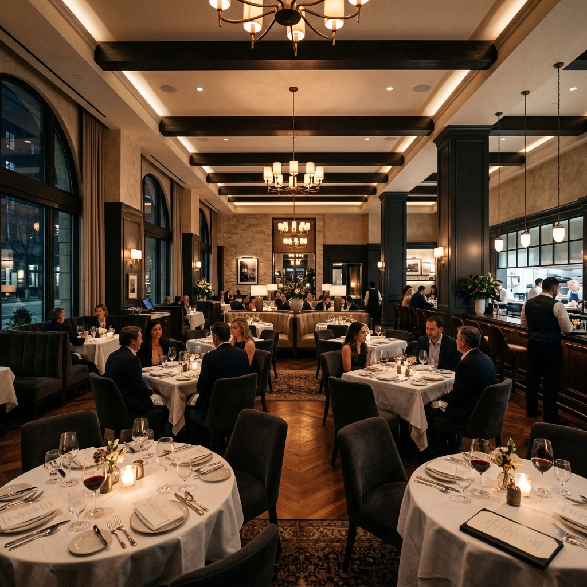

# ✨ The Fifth Spice


A premium-style restaurant website experience built with **HTML, CSS, and vanilla JavaScript**.  
The project includes an animated landing page, interactive menu flow, booking/contact forms, and a simulated cart/checkout journey.



## 🌟 Highlights

- Cinematic hero section with animated branding and navigation
- Full-screen side panel with tabs for **Menu**, **Bookings**, **Cart**, and **Favorites**
- Interactive dish cards with:
  - Add-to-cart actions
  - Favorite toggles
  - Ratings and pricing display
- Cart + checkout simulation with:
  - Delivery details step
  - Payment step
  - Invoice generation and PDF download (`html2pdf`)
  - Order tracking progression UI
- Separate `about.html` page with reservation/contact call-to-actions
- Local persistence for cart/favorites using `localStorage`

## 🧰 Tech Stack

### Core
- **HTML5**
- **CSS3**
- **JavaScript (ES6, no framework)**
- **Python** (optional utility scripts for repository maintenance/refactors)

### External libraries/CDNs used in the project
- **GSAP** (`gsap`, `SplitText`, `ScrollTrigger`, `Flip`) for animations
- **Font Awesome** for iconography
- **Google Fonts** for typography
- **html2pdf.js** for invoice PDF export

## 🚀 Setup & Installation

No package manager or build step is required.

1. Clone the repository:
   ```bash
   git clone https://github.com/noobcoder1982/thefifthspice.git
   cd thefifthspice
   ```
2. Open the project in a browser:
   - Directly open `index.html`, or
   - Run a local server (recommended):
     ```bash
     python3 -m http.server 8080
     ```
     Then visit: `http://localhost:8080`

## 🖱️ Usage

- Start at `index.html` for the main restaurant experience.
- Use the top nav actions (`MENU`, `BOOKINGS`, `CART`, `FAV`, `LOGIN`) to open interactive flows.
- Try the checkout sequence:
  1. Add one or more dishes to cart
  2. Open **CART** and proceed through checkout
  3. Complete payment simulation
  4. Download invoice PDF
  5. View order-tracking animation
- Visit `about.html` for the dedicated about/reservation page.

## 📁 Project Structure (Brief)

```text
thefifthspice/
├── index.html        # Main landing + menu/cart/favorites/checkout flow
├── about.html        # About/reservation/contact oriented page
├── style.css         # Complete styling (theme, layout, animations)
├── script.js         # UI behavior, localStorage, checkout/tracking logic
├── Images/           # Local image assets used by the site
├── fontfiles/        # Local custom font files
├── script.py         # Optional utility script
├── restructure.py    # Optional utility script
├── rewrite_all.py    # Optional utility script
└── update_script.py  # Optional utility script
```

## 🤝 Contributing

Contributions are welcome.

1. Fork the repository
2. Create a feature branch
3. Make focused changes
4. Open a pull request with a clear description

## 📄 License

No license file is currently present in this repository, so no explicit license is specified.  
For reuse or distribution permissions, contact the repository owner.

## 👤 Contact / Credits

- Repository owner: **[@noobcoder1982](https://github.com/noobcoder1982)**
